# Case Stone – Medallion Orchestration (GCP)

Arquitetura proposta para ingestão e processamento do CNPJ (RFB) em 3 camadas (Bronze → Silver → Gold) usando **Cloud Workflows** + **Dataproc Serverless** e três modos de ingestão intercambiáveis:
- **Cloud Run (HTTP)** – serviço `ingest-rfb` (container) baixa os arquivos e grava em `raw/<run_id>/`.
- **Storage Transfer Service (STS)** – job gerenciado copia direto para o bucket.
- **VM** – alternativa de contingência que escreve um *marker* em GCS quando conclui.

O **Workflows** orquestra: escolhe o modo de ingestão, aguarda *markers/arquivos*, dispara lotes do Dataproc (bronze/silver/gold/load) e grava *markers* por etapa.

## Componentes

- **Bucket GCS** (`case-stone-medallion-<proj>`):

```bash
[RFB Dados Abertos] --(HTTP/ZIP)--> [Ingestão desacoplada]
                                   ├─ (A) Cloud Run (HTTP, container)
                                   ├─ (B) Storage Transfer Service
                                   └─ (C) VM (marker via serial/GCS)

[Google Cloud Storage]
   ├─ raw/<run_id>/*.zip
   ├─ bronze/<run_id>/{empresas,socios}/*.csv
   ├─ silver/<run_id>/{empresas,socios}/.parquet
   ├─ gold/<run_id>/resultado_final/.parquet
   └─ markers/<run_id>/{ingest|bronze|silver|gold|load}.SUCCESS

[Google Cloud Workflows]  → orquestra tudo (gates por marker e polling de jobs)
     ├─ cria batches no Dataproc Serverless (Spark) p/ bronze/silver/gold/load
     └─ controla falhas e reentrância (idempotência via markers e run_id)

[Dataproc Serverless for Spark]
     ├─ bronze.py  → unzip p/ GCS
     ├─ silver.py  → schemas, normalizações, parquet
     ├─ gold.py    → regras de negócio (agregações/flags)
     └─ load_postgres.py → escreve em Cloud SQL (UPSERT por CNPJ)

[Cloud SQL (Postgres)]
     └─ Tabela final por CNPJ (chave primária), pronta p/ apps transacionais
```




```mermaid
flowchart LR

  %% === SOURCES ===
  subgraph SRC["RFB Dados Abertos"]
    s1["ZIPs publicos:<br/>EmpresasN.zip / SociosN.zip"]
  end

  %% === INGEST ===
  subgraph ING["Ingestão desacoplada"]
    A["Cloud Run - HTTP, container"]
    B["Storage Transfer Service"]
    C["VM - marker via serial -> GCS"]
  end

  %% === STORAGE ===
  subgraph GCS["Cloud Storage e Data Lake"]
    raw["raw/<run_id>/*.zip"]
    brz["bronze/run_id/<br/>empresas,socios/*.csv"]
    slv["silver/run_id/<br/>empresas,socios/*.parquet"]
    gld["gold/run_id/<br/>resultado_final/*.parquet"]
    mrk["markers/run_id/<br/>ingest,bronze,silver,gold, <br/>load;.SUCCESS"]
  end

  %% === WORKFLOWS ===
  subgraph WF["Google Cloud Workflows"]
    wf1["Orquestração: gates por marker ; polling de jobs;"]
  end

  %% === SPARK ===
  subgraph DP["Dataproc Serverless - Spark"]
    p1["bronze.py - Unzip para GCS"]
    p2["silver.py - Schemas/normalizações -> Parquet"]
    p3["gold.py - Agregações/flags"]
    p4["load_postgres.py - UPSERT em Postgres"]
  end

  %% === DB ===
  subgraph SQL["Cloud SQL - Postgres "]
    tbl["Tabela final por CNPJ<br/>&#40;PK: cnpj&#41;"]
  end

  %% === FLOWS ===
  s1 --> A & B & C

  A --> raw
  B --> raw
  C --> mrk

  wf1 --> p1 --> brz --> mrk
  wf1 --> p2 --> slv --> mrk
  wf1 --> p3 --> gld --> mrk
  wf1 --> p4 --> tbl --> mrk
```

### Decisões

- Eu quis desacoplar ingestão do processamento. 
O Workflows só “espera um sinal” (marker/arquivos) e toca o Spark. Isso reduz acoplamento, deixa claro onde cada parte falha e me dá flexibilidade: se amanhã alguém quiser puxar o raw com outro método (SFTP, API, crawler…), o pipeline Spark continua igual. Também foi intencional tentar 3 caminhos de ingest (Cloud Run, STS, VM), por robustez — se um modo falhar, tenho outras alternativas já implantadas.

- Postgres (Cloud SQL) na saída: o case pede um banco que permita aplicações transacionais plugarem. Postgres é padrão de mercado, tem chave primária/UPSERT, integra bem com apps e é fácil de versionar/limpar pra homologações.
Se o foco fosse 100% analytics, eu apontaria pra BigQuery com certeza. 
Como eu entendi que "aplicações transacionais plugarem" significaria que necessariamente, estava pedindo por um ambiente transacional para ser possível as aplicações transacionais plugarem, concluí que naturalmente a escolha certa seria um ambiente transacional também, para que fosse possível plugar as aplicações. Em um ambiente analítico, isso não seria possível.

- Spark (Dataproc Serverless): eu gosto bastante de usar Spark e o volume dos dados da RFB pede (COM CERTEZA PEDE) processamento distribuído. Usei Serverless pra não gerenciar cluster.

- Workflows: simples, barato, sem cluster e state machine clara, e também eu não havia usado esse serviço antes e queria usar uma ferramenta inédita pois ao menos terei aprendido, pelo menos o básico, desse serviço. O que de fato ocorreu, pois passei mais de 60 horas para fazer esse desafio e boa parte desse tempo, em torno de 80 %, foi no workflows. 
Eu cogitei em usar o Airflow, separando uma dag para ingestao, com diferentes tasks nos 3 modos possíveis, e outras dags para bronze, silver e gold, separadamente. Mas manter um Composer é caro, e acredito que seria justificado se tivessem mais etapas e interdependências.
Eu construí gates por markers no GCS e polling do estado dos batches Dataproc. Isso me deu idempotência por run_id e reexecução segura.

- Containerização: a camada de ingestão HTTP foi empacotada (Flask + requests) e publicada em Cloud Run (container). O Spark em si já roda “serverless” no Dataproc, não faria sentido colocar em um container.

- Observabilidade/operacional: os markers deixam claro o ponto de falha. O que deu erro? Em que step? O que deu certo? Tudo é parametrizável via run_id e JSON de execução do Workflows. Ficou mais fácil reexecutar só o que falta. O que já deu certo, não é reexecutado.

### Camadas medalhão

- **Bronze**: descompacto os zips da RFB direto no GCS, preservando o bruto por tipo (empresas/, socios/).

- **Silver**: schema, limpeza e tipos (ex.: normalizo capital_social, tipos inteiros, encoding latin1 → parquet particionado por run_id).

- **Gold**: regras de negócio enxutas (ex.: qtde_socios, flag_socio_estrangeiro, doc_alvo para porte e critérios). Resultado final em parquet (e depois load para Postgres).


### Ingestão desacoplada (3 modos)

- (A) Cloud Run (HTTP container)
Recebe bucket, prefixo raw/run_id, urls (RFB) e baixa cada zip direto no GCS. Quando terminar, escreve ingest.SUCCESS.
HTTP 504 na UI? Proxy pode estourar timeout, mas o job continua; o marker é a verdade, e o Workflows não depende do 200 para progredir — ele observa o marker.

- (B) Storage Transfer Service (STS)
Defini um job de transferência HTTP→GCS e o Workflows poll a pasta raw/<run_id>/. Achando o arquivo, prossegue.

- (C) VM (marker)
Plano C: se eu precisar rodar scripts legados numa VM, o Workflows liga a VM, espera o marker e segue. Útil pra migrações.


### Execução prática
No CLI, copio e colo esse comando, aperto enter e vou pra UI acompanhar o diagrama em tempo real
```bash
gcloud workflows execute medallion-spark \
  --project="$PROJECT_ID" \
  --location="$REGION" \
  --data="$(< ~/infra/exec.json)"
```

  Executo com um payload único.

  Eu padronizei um exec.json no repo, mas nao o coloquei aqui porque tem muitas informações sensíveis, desde usuário, senha do db, urls entre muitas outras informações.

Visão da UI:


### Estrutura do repositório

```bash
  case_stone/
├─ README.md
├─ .gitignore
├─ infra/
│  ├─ workflow_medallion.yaml
│  └─ exec.json        # payload de execução (project/region/run_id/paths/jars/db)
├─ code/
│  ├─ bronze.py
│  ├─ silver.py
│  ├─ gold.py
│  └─ load_postgres.py
└─ cf/                 # ingestão HTTP containerizada (Cloud Run)
   ├─ Dockerfile
   ├─ requirements.txt
   └─ main.py
```

### Custos e limites

- Serverless (Dataproc/Workflows/Run) me ajuda a pagar só quando executa.

- Se o volume crescer, autoscaling de executors no Spark e partitioning no silver/gold já estão configurados.

- Para catálogo, dá pra plugar BigLake/Dataplex. Para linage, OpenLineage + Marquez (ou Data Catalog).

- Se algum dia essa ingestão precisar de SLA forte, eu colocaria Pub/Sub + Cloud Run jobs com retry/backoff.


