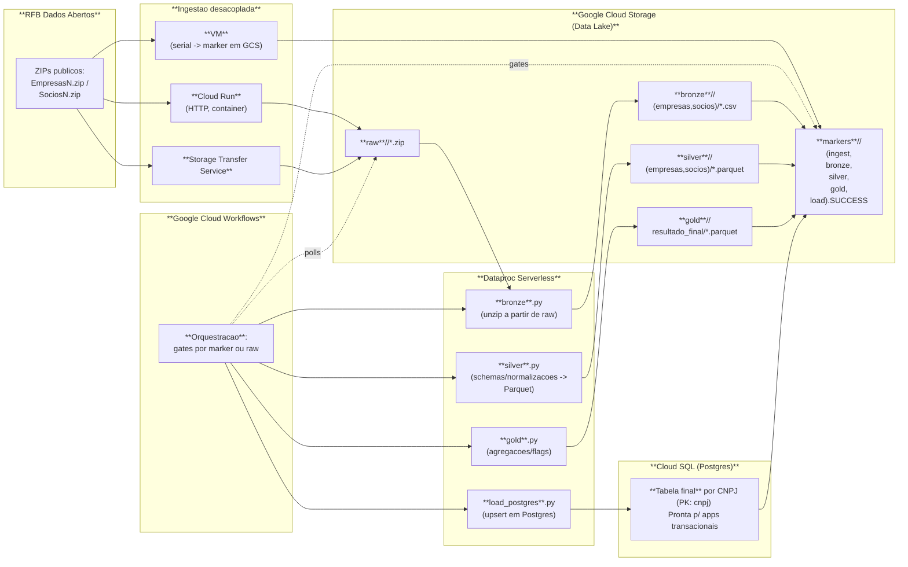

# Case Stone – Medallion Orchestration (GCP)

Arquitetura proposta para ingestão e processamento do CNPJ (RFB) em 3 camadas (Bronze → Silver → Gold) usando **Cloud Workflows** + **Dataproc Serverless** e três modos de ingestão intercambiáveis:
- **Cloud Run (HTTP)** – serviço `ingest-rfb` (container) baixa os arquivos e grava em `raw/<run_id>/`.
- **Storage Transfer Service (STS)** – job gerenciado copia direto para o bucket.
- **VM** – alternativa de contingência que escreve um *marker* em GCS quando conclui.

O **Workflows** orquestra: escolhe o modo de ingestão, aguarda *markers/arquivos*, dispara lotes do Dataproc (bronze/silver/gold/load) e grava *markers* por etapa.

## Componentes




## Pipelines Spark

**bronze**.py
Lê raw_zips/*.zip do GCS, unzip para bronze/<run_id>/{empresas,socios}/… e escreve markers/<run_id>/bronze.SUCCESS.

**silver**.py
Lê CSV bruto, aplica schemas e casts, corrige capital_social, escreve parquet em silver/<run_id>/{empresas,socios} e marca silver.SUCCESS.

**gold**.py
Junta silver/empresas + silver/socios, calcula agregações e flags, salva em gold/<run_id>/resultado_final e marca gold.SUCCESS.

**load_postgres**.py
Lê o gold, conecta em Cloud SQL Postgres (via JDBC + Cloud SQL connector), faz UPSERT por CNPJ (idempotente) e marca load.SUCCESS.


### Decisões

- Eu quis desacoplar **ingestão** do processamento. 
O Workflows só “espera um sinal” (marker/arquivos) e toca o Spark. Isso reduz acoplamento, deixa claro onde cada parte falha e me dá flexibilidade: se amanhã alguém quiser puxar o raw com outro método (SFTP, API, crawler…), o pipeline Spark continua igual. Também foi intencional tentar 3 caminhos de ingest (Cloud Run, STS, VM), por robustez — se um modo falhar, tenho outras alternativas já implantadas.

- **Postgres** (Cloud SQL) na saída: o case pede um banco que permita aplicações transacionais plugarem. Postgres é padrão de mercado, tem chave primária/UPSERT, integra bem com apps e é fácil de versionar/limpar pra homologações.
Se o foco fosse 100% analytics, eu apontaria pra BigQuery com certeza. 
Como eu entendi que "aplicações transacionais plugarem" significaria que necessariamente, estava pedindo por um ambiente transacional para ser possível as aplicações transacionais plugarem, concluí que naturalmente a escolha certa seria um ambiente transacional também, para que fosse possível plugar as aplicações. Em um ambiente analítico, isso não seria possível.

- **Spark** (Dataproc Serverless): eu gosto bastante de usar Spark e o volume dos dados da RFB pede (COM CERTEZA PEDE) processamento distribuído. Usei Serverless pra não gerenciar cluster.

- **Workflows**: simples, barato, sem cluster e state machine clara, e também eu não havia usado esse serviço antes e queria usar uma ferramenta inédita pois ao menos terei aprendido, pelo menos o básico, desse serviço. O que de fato ocorreu, pois passei mais de 60 horas para fazer esse desafio e boa parte desse tempo, em torno de 80 %, foi no workflows. 
Eu cogitei em usar o Airflow, separando uma dag para ingestao, com diferentes tasks nos 3 modos possíveis, e outras dags para bronze, silver e gold, separadamente. Mas manter um Composer é caro, e acredito que seria justificado se tivessem mais etapas e interdependências.
Eu construí gates por markers no GCS e polling do estado dos batches Dataproc. Isso me deu idempotência por run_id e reexecução segura.

- **Containerização**: a camada de ingestão HTTP foi empacotada (Flask + requests) e publicada em Cloud Run (container). O Spark em si já roda “serverless” no Dataproc, não faria sentido colocar em um container.

- **Observabilidade/operacional**: os markers deixam claro o ponto de falha. O que deu erro? Em que step? O que deu certo? Tudo é parametrizável via run_id e JSON de execução do Workflows. Ficou mais fácil reexecutar só o que falta. O que já deu certo, não é reexecutado.

### Camadas medalhão

- **Bronze**: descompacto os zips da RFB direto no GCS, preservando o bruto por tipo (empresas/, socios/).

- **Silver**: schema, limpeza e tipos (ex.: normalizo capital_social, tipos inteiros, encoding latin1 → parquet particionado por run_id).

- **Gold**: regras de negócio enxutas (ex.: qtde_socios, flag_socio_estrangeiro, doc_alvo para porte e critérios). Resultado final em parquet (e depois load para Postgres).


### Ingestão desacoplada (3 modos)

- (A) **Cloud Run** (HTTP container)
Recebe bucket, prefixo raw/run_id, urls (RFB) e baixa cada zip direto no GCS. Quando terminar, escreve ingest.SUCCESS.
HTTP 504 na UI? Proxy pode estourar timeout, mas o job continua; o marker é a verdade, e o Workflows não depende do 200 para progredir — ele observa o marker.

- (B) **Storage Transfer Service** (STS)
Defini um job de transferência HTTP→GCS e o Workflows poll a pasta raw/<run_id>/. Achando o arquivo, prossegue.

- (C) **VM** (marker)
Plano C: se eu precisar rodar scripts legados numa VM, o Workflows liga a VM, espera o marker e segue. Útil pra migrações.


### Execução prática
No CLI, copio e colo esse comando, aperto enter e vou pra UI acompanhar o diagrama em tempo real
```bash
gcloud workflows execute medallion-spark \
  --project="$PROJECT_ID" \
  --location="$REGION" \
  --data="$(< ~/infra/exec.json)"
```

  Executo com um payload único.

  Eu padronizei um exec.json no repo, mas nao o coloquei aqui porque tem muitas informações sensíveis, desde usuário, senha do db, urls entre muitas outras informações.

Visão da UI:


### Estrutura do repositório

```bash
  case_stone/
├─ README.md
├─ .gitignore
├─ infra/
│  ├─ workflow_medallion.yaml
│  └─ exec.json        # payload de execução (project/region/run_id/paths/jars/db)
├─ code/
│  ├─ bronze.py
│  ├─ silver.py
│  ├─ gold.py
│  └─ load_postgres.py
└─ cf/                 # ingestão HTTP containerizada (Cloud Run)
   ├─ Dockerfile
   ├─ requirements.txt
   └─ main.py
```

### Custos e limites

- Serverless (Dataproc/Workflows/Run) me ajuda a pagar só quando executa.

- Se o volume crescer, autoscaling de executors no Spark e partitioning no silver/gold já estão configurados.

- Para catálogo, dá pra plugar BigLake/Dataplex. Para linage, OpenLineage + Marquez (ou Data Catalog).

- Se algum dia essa ingestão precisar de SLA forte, eu colocaria Pub/Sub + Cloud Run jobs com retry/backoff.


### (A) **Cloud Run** (HTTP container)

Foi empacotado uma API HTTP simples (Flask) que baixa os ZIPs da RFB para o GCS e grava um marker. Isso é executado em Cloud Run (container gerenciado). Ele escala a zero quando está ocioso e sobe sob demanda quando o Workflow chama a URL. 
É totalmente stateless: tudo que precisa vem no JSON da requisição (bucket/prefix/run_id/urls/marker).

- Cloud Run recebe {bucket, prefix, run_id, urls[], marker} e faz só a coleta (download → raw/<run_id>/ + markers/<run_id>/ingest.SUCCESS).

- Workflow faz o encadeamento bronze → silver → gold → load (Dataproc Serverless) e só avança quando encontra os markers (idempotência).

- Dataproc Serverless (Spark) roda os .py (bronze/silver/gold/load).

- Cloud SQL (Postgres) recebe a tabela final (UPSERT por CNPJ)

 **Custo**

No Cloud Run o custo é por vCPU-segundo, GiB-segundo de RAM e requisições, apenas enquanto o request está sendo processado.

**Build & deploy do container no Cloud Run**

```bash
# vars
export PROJECT_ID=case-stone-471402
export REGION=us-central1
export REPO=medallion-artifacts
export SERVICE=ingest-rfb

# (uma vez) repositório de imagens
gcloud artifacts repositories create "$REPO" \
  --repository-format=docker --location="$REGION" 2>/dev/null || true

# build & push (pasta ~/cf com Dockerfile, requirements.txt, main.py)
gcloud builds submit ~/cf \
  --tag "$REGION-docker.pkg.dev/$PROJECT_ID/$REPO/$SERVICE:v1"

# deploy (HTTP público; ajuste recursos/timeout conforme necessário)
gcloud run deploy "$SERVICE" \
  --image "$REGION-docker.pkg.dev/$PROJECT_ID/$REPO/$SERVICE:v1" \
  --region "$REGION" \
  --allow-unauthenticated \
  --cpu=1 --memory=512Mi --concurrency=1 --timeout=900

# pegar a URL
CF_URL=$(gcloud run services describe "$SERVICE" \
  --region="$REGION" --format='value(status.url)')
echo "$CF_URL"
```

**Testar rápido a ingestão (manual)**

 ```bash
RUN_ID="smoke-$(date +%H%M%S)"
BUCKET=case-stone-medallion-471402
EMP_URL="https://dadosabertos.rfb.gov.br/CNPJ/Empresas0.zip"
SOC_URL="https://dadosabertos.rfb.gov.br/CNPJ/Socios0.zip"

payload=$(jq -c -n \
  --arg bucket "$BUCKET" \
  --arg prefix "raw/$RUN_ID/" \
  --arg run_id "$RUN_ID" \
  --arg emp "$EMP_URL" \
  --arg soc "$SOC_URL" \
  --arg marker "markers/$RUN_ID/ingest.SUCCESS" \
  '{bucket:$bucket, prefix:$prefix, run_id:$run_id, urls:[$emp,$soc], marker:$marker}')

curl -i -X POST "$CF_URL" \
  -H "Content-Type: application/json" \
  -d "$payload"

```
**Atualizar o exec.json (se quiser rodar tudo via Workflow)**
```bash
cat > ~/infra/exec.json <<EOF
{
  "cfg": {
    "project_id": "$PROJECT_ID",
    "region": "$REGION",
    "bucket": "$BUCKET",
    "run_id": "exec-$(date +%Y%m%d-%H%M%S)",

    "ingest_mode": "function",
    "function_url": "$CF_URL",
    "ingest_urls": [
      "https://dadosabertos.rfb.gov.br/CNPJ/Empresas0.zip",
      "https://dadosabertos.rfb.gov.br/CNPJ/Socios0.zip"
    ],

    "bronze_py": "gs://$BUCKET/code/bronze.py",
    "silver_py": "gs://$BUCKET/code/silver.py",
    "gold_py":   "gs://$BUCKET/code/gold.py",
    "load_py":   "gs://$BUCKET/code/load_postgres.py",

    "jar_cloudsql": "gs://$BUCKET/jars/cloud-sql-postgres-1.17.0.jar",
    "jar_postgres": "gs://$BUCKET/jars/postgresql-42.7.4.jar",

    "instance_conn_name": "case-stone-471402:us-central1:stone-pg",
    "db_name": "stone",
    "db_user": "stone",
    "db_pass": "stone123!"
  }
}
EOF

gcloud workflows execute medallion-spark \
  --project="$PROJECT_ID" \
  --location="$REGION" \
  --data="$(< ~/infra/exec.json)"
```
**Acompanhar execução**
```bash
EXEC_ID="$(gcloud workflows executions list medallion-spark \
  --location="$REGION" --limit=1 --format='value(name)')"

gcloud workflows executions describe "$EXEC_ID" \
  --location="$REGION" \
  --format='value(state,result,error)'

# logs (útil se algo quebrar durante download)
gcloud logging read \
  'resource.type="cloud_run_revision" AND resource.labels.service_name="ingest-rfb"' \
  --limit=50 --format='value(textPayload)'
```

```bash

```

```bash

```

```bash

```


**

###(B) **Storage Transfer Service** (STS)

O STS é o serviço gerenciado do Google pra puxar/empurrar dados entre fontes e o Cloud Storage, com paralelismo, reintentos, verificação de integridade e agendamento. Pra este case, usei o modo “Transfer from the Internet” (HTTP/HTTPS), já que os ZIPs da RFB ficam publicados em URLs públicas.

**Custos**

 - Cloud Storage ingress (upload): R$ 0.
 - Operações: cada objeto gravado conta como Classe A (baratinho, mas existe). Como são poucos arquivos (ZIPs grandes), o custo é irrelevante.
 - STS em si: o uso do serviço não tem taxa separada; você paga os recursos de Storage/Network conforme a tabela do Cloud Storage.

**Manifesto de URLs**

Eu monto uma lista de URLs (um arquivo .txt no próprio GCS, uma por linha

```bash
https://dadosabertos.rfb.gov.br/CNPJ/Empresas0.zip
https://dadosabertos.rfb.gov.br/CNPJ/Socios0.zip
```

**Job do STS**

Crio um Transfer Job “from the Internet” apontando esse manifesto como fonte e o prefixo de destino no bucket como raw/<run_id>/.

**Permissões**

O STS usa a service account gerenciada do projeto no padrão:

```bash
<PROJECT-NUMBER>-compute@developer.gserviceaccount.com
```
Eu dei Storage Object Admin no bucket de destino, pra ele poder gravar os ZIPs.

**Execução via Workflow**

No meu workflow_medallion.yaml, quando eu seleciono ingest_mode: "sts", eu:

 - começo o job com transferJobs.run (o job já está criado, só mando rodar),

 - fico executando poll no GCS: gs://<bucket>/raw/<run_id>/ até aparecerem objetos,

Quando aparece arquivo, eu sigo pro Bronze (Spark no Dataproc).

 - O STS só baixa; o marcador de sucesso da ingestão eu não gravo por STS (não há necessidade). Eu “considero ingerido” quando vejo pelo menos um objeto em raw/<run_id>/.

 - O resto do fluxo (bronze/silver/gold/load) continua com markers markers/<run_id>/*.SUCCESS como antes.

 - Um run_id por execução: evita confundir escrita de um run no outro. Também deixa claro no bucket o que pertence a cada execução.

 - Prefixos fixos por camada (raw/run_id, bronze/run_id, …) e markers (markers/run_id/*.SUCCESS) pra retomar de onde parou.

 - Manifesto versionado: coloco o urls.txt dentro de infra/ no repo, e copio pro GCS num prefixo com run_id antes de criar/rodar o job. Fica auditável.

 - Backoff no polling: no Workflow, o loop de listing tem sleep e timeout implícito (pela duração total do workflow). Se estourar tempo, falha com erro claro de ingestão.
